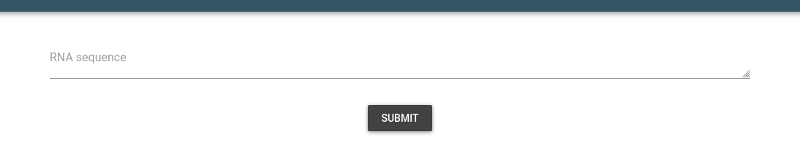
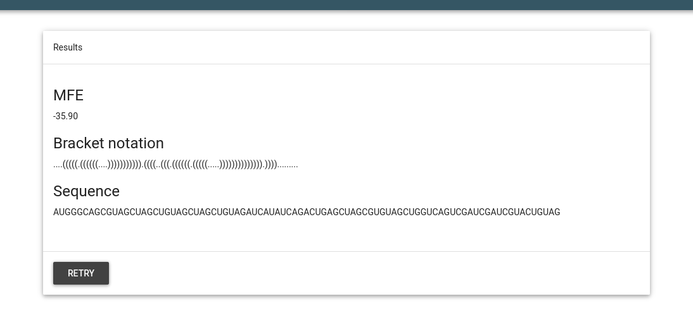

### About
This example shows how to use `py2webapp`. To try this, you can do this and follow the printed instructions to run the webapp:

```
py2webapp.py -f examples/RNAfold/RNAfold.py -c examples/RNAfold/config

===========================================
App generated as app.py!
Now, make your script executable by using:
	chmod +x RNAfold.py
Then run the app as following:
	python3 app.py
The app will run at http://localhost:5050
🛸 😊 
===========================================

```


### Explanation
The `RNAfold.py` is a wrapper around the well known program RNAfold to compute the minimum free energy of RNA. The arguments for this wrapper are:

```
usage: Program [-h] [-v] -s SEQUENCE

Description

optional arguments:
  -h, --help            show this help message and exit
  -v, --version         Show program's version number and exit.
  -s SEQUENCE, --sequence SEQUENCE
                        Input sequence

Author

```

`h` and `v` are default arguments and we don't need them. The other option is `s`, which is your RNA sequence. 

#### Making `config` file
First we make a config file using these arguments. The config file looks like:

```
text_input = {
    'RNA sequence':'s',
}

numerical_input = {
    
}

app_properties = {
    'Name': 'RNAfold wrapper',
    'Description': 'Made using py2webapp',
    'Author': 'github@bkb3'
}


```
Note that we use `s` in the config file, exactly as required in the input args. Other names are descriptive.

#### Modifying the `RNAfold.py` script
The output is the MFE, dotbracket notation and the input sequence:

```
    results = [new_.stdout.decode().split('\n')[1].split(' ')[1][1:-1], 
                new_.stdout.decode().split('\n')[1].split(' ')[0],
                new_.stdout.decode().split('\n')[0]
    ]
```
Normally, we would return this as `return results`.

To convert into webapp, the `return` statetment is commented out. Then we add a `dictionary` as follows:

```
    result_dict = {}
    result_dict["MFE"] = results[0]
    result_dict["Bracket notation"] = results[1]
    result_dict["Sequence"] = results[2]
```
Note that the keys 'MFE' etc appear as such in the website so make sure it is informative enough for the users to interpret and understand. 


Now, the final step is to `print` this dictionary as `print(result_dict)`.

---
After running the generated app, you should see something like this:

### Input


### Output


