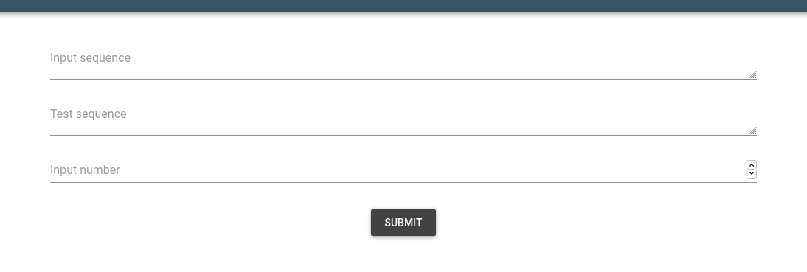
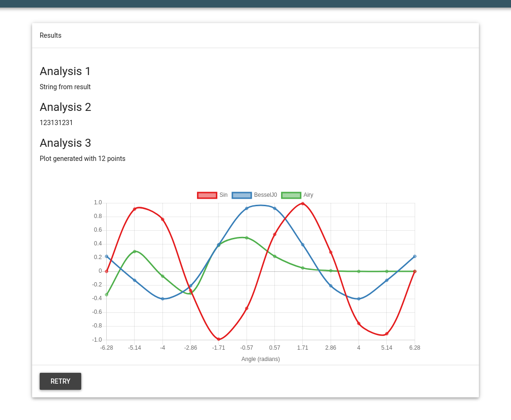

### About
This example shows how to use plot function in `py2webapp`. To try this, you can do this and follow the printed instructions to run the webapp:


```
python3 py2webapp.py -f examples/Test_Long_Function/test_long_function.py -c examples/Test_Long_Function/config

===========================================
App generated as app.py!
Now, make your script executable by using:
	chmod +x test_long_function.py
Then run the app as following:
	python3 app.py
The app will run at http://localhost:5050
🛸 😊 
===========================================

```


### Explanation
The `test_long_function.py` simulates an demo program taking some time (10s) to execute. 
The arguments for this program are:

```
usage: Program [-h] [-v] -s INPUTSEQUENCE -t TESTSEQUENCE -x INPUTNUMBER

Description

optional arguments:
  -h, --help            show this help message and exit
  -v, --version         Show program's version number and exit.
  -s INPUTSEQUENCE, --inputSequence INPUTSEQUENCE
                        Input sequence
  -t TESTSEQUENCE, --testSequence TESTSEQUENCE
                        Test sequence
  -x INPUTNUMBER, --inputNumber INPUTNUMBER
                        Numerical Input

Author

```

`h` and `v` are default arguments and we don't need them. The other options are `s`, `t` and `x` which are strings and numbers.

#### Making `config` file
First we make a config file using these arguments. The config file looks like:

```
text_input = {
    'Input sequence':'s',
    'Test sequence': 't',
}

numerical_input = {
    'Input number': 'x',
}

app_properties = {
    'Name': 'Test long function',
    'Description': 'Made using py2webapp',
    'Author': 'github@bkb3'
}
```
Note that we use `s`, `t` and `x` in the config file, exactly as required in the input args. Other names are descriptive.

#### Modifying the `test_long_function.py` script
The output is a bunch of random results as strings and  integer:

```
results = ['String from result' , 123131231, \
        'Plot generated with {} points'.format(x)]
```
Normally, we would return this as `return results`.

To convert into webapp, the `return` statetment is commented out. Then we add a `dictionary` as follows:

```
    result_dict = {}
    result_dict["Analysis 1"] = results[0]
    result_dict["Analysis 2"] = results[1]
    result_dict["Analysis 3"] = results[2]
```
Note that the keys 'Analysis 1' etc appear as such in the website so make sure it is informative enough for the users to interpret and understand. 


In this case, we also want to plot outputs. For this, I first generate some points for `x` axis. For these points, the `y` axis will be the Sin, Bessel function of the first kind of order 0 and Airy function from `scipy.special`. You need to have scipy and numpy installed for this to work!

```
    plot_data_x = np.round(np.linspace(-2*np.pi, 2*np.pi, x), 2).tolist()
    plot_data_y0 = np.round(np.sin(plot_data_x), 2).tolist()
    plot_data_y1 = np.round(special.j0(plot_data_x), 2).tolist()
    plot_data_y2 = np.round(special.airy(plot_data_x)[0], 2).tolist()
```
Then, simply add these as `Plot` to the `result_dict` we made above.
```
    result_dict["Plot"] = {
        'x': plot_data_x,
        'y': [plot_data_y0, plot_data_y1, plot_data_y2],
        'type': 'line',
        'xlabel': 'Angle (radians)',
        'ylabel': ['Sin', 'BesselJ0', 'Airy']
    }
```
Note, that `y` should always be a list, even if it's just one plot eg. `[plot_data_y0]`. For plot types, currently it's just `line` and `bar`. `xlabel`, `ylabel` are self explanatory and they appear as such in the website. 

Now, the final step is to `print` this complete dictionary as `print(result_dict)`.


---
After running the generated app, you should see something like this:

### Input


### Output

